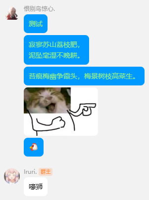

    

    QQNT消息靠左连续展示 (类QQ频道)

# LiteLoaderQQNT-Message-Show

[LiteLoaderQQNT](https://github.com/mo-jinran/LiteLoaderQQNT) 插件

仓库创建自 [LiteLoaderQQNT-Plugin-Template](https://github.com/mo-jinran/LiteLoaderQQNT-Plugin-Template)

## 功能
- 消息连续显示
    - 来自同一用户相同时段内的消息，将不会重复显示用户头像及昵称，消息气泡将会连续显示

    - 功能实现函数来自[MUKAPP/LiteLoaderQQNT-MSpring-Theme](https://github.com/MUKAPP/LiteLoaderQQNT-MSpring-Theme)

- 自己消息靠左展示

    - 自己发送的消息，将会跟他人消息一样展示在左边

### 效果截图

## 开源协议
[MIT License](./LICENSE)  
Copyright (c) 2023 恨别鸟惊心_

本插件仅供个人学习使用。请遵纪守法，后果自负